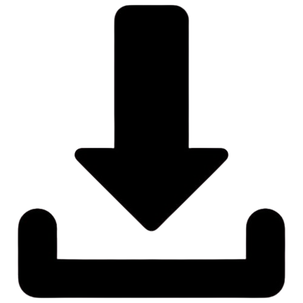

<!-- README.md de Nexor Oficial -->

<div align="center">
  
<a href="https://emiliano-hn.github.io/Nexor/">
  
</a>
</div>

<p align="center" >𝓓𝓲𝓼𝓮ñ𝓪𝓭𝓸 𝓹𝓪𝓻𝓪 𝓭𝓮𝓼𝓪𝓻𝓻𝓸𝓵𝓵𝓪𝓭𝓸𝓻𝓮𝓼 𝓺𝓾𝓮 𝓫𝓾𝓼𝓬𝓪𝓷 𝓮𝓵𝓮𝓰𝓪𝓷𝓬𝓲𝓪</p>

<div style="margin-top:40px;">
  <p>Herramientas de QR:</p>
  <a href="https://github.com/user-attachments/files/22061570/Nexor.QR.zip">
    
  </a>
</div>

<!-- Separación entre QR y código -->
<div style="height:30px;"> </div>

```bash
# Estaneo en Nexor v.3.0.2 Demo

ble hosts = ["192.168.1.1", "192.168.1.2", "192.168.1.3"]
ble puertos = [22, 80, 443, 8080]
ble resultados = []

fun probar(host, puerto)
    dic (host + ":" + str(puerto)) not in resultados
        ble status = "Cerrado"
        dic puerto % 2 == 0
            status = "Abierto"
        nal
        resultados.append(host + ":" + str(puerto) + " → " + status)
    nuf
nuf

fun escaneo_total()
    rp len(hosts)
        ble host = hosts[contador-1]
        rp len(puertos)
            ble puerto = puertos[contador-1]
            probar(host, puerto)
        nuf
    nuf

    Vek "Resultados del escaneo:"
    rp len(resultados)
        ble linea = resultados[contador-1]
        dic "•" in linea
            Vek "✓" + linea
        nal
            Vek "✗" + linea
    nuf
nuf

escaneo_total()

```

<h1 align="center">Todas las versiones de Nexor:</h1>

<table>
  <tr>
    <td align="center">
      Nexor v1.1.0<br>
      <a href="https://github.com/user-attachments/files/22035692/Nexor.v1.1.0.zip" download>
        
      </a>
    </td>
    <td align="center">
      Nexor v1.9.2<br>
      <a href="https://github.com/user-attachments/files/22035918/Nexor-v1.9.2.zip">
        
      </a>
    </td>
    <td align="center">
      Nexor v2.9.3<br>
      <a href="https://github.com/user-attachments/files/22035929/Nexor-v2.9.3.zip">
        
      </a>
    </td>
    <td align="center">
      Nexor v2.9.4<br>
      <a href="https://github.com/user-attachments/files/22035939/Nexor-v2.9.4.zip">
        
      </a>
    </td>
  </tr>
</table>

<h1 align="center">LICENSE</h1>

<table>
  <tr>
    <td>
      
    </td>
  </tr>
</table>

<p align="left">Descarga Documento:</p>
<table>
  <tr>
    <td align="center">PNG<br>
      <a href="https://github.com/user-attachments/files/22036534/PNG.zip" download>
        
      </a>
    </td>
    <td align="center">PDF<br>
      <a href="https://github.com/user-attachments/files/22036574/PDF.zip">
        
      </a>
    </td>
  </tr>
</table>
<div align="center">
   
</div>
